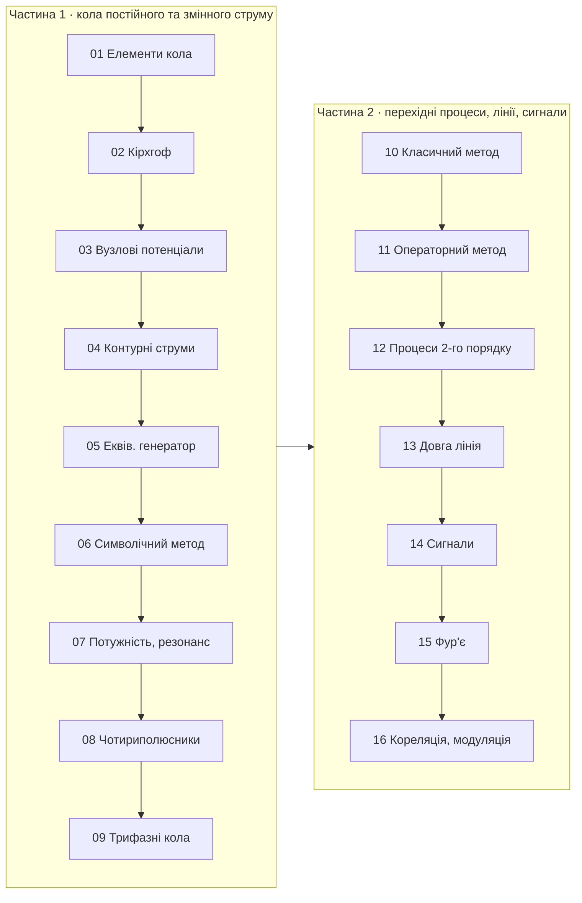

<div align="center">

# 📡 Основи радіоелектроніки

**Інтерактивний конспект лекцій українською мовою**

Національний університет «Чернігівська політехніка»

[](https://mybinder.org/v2/gh/vim4all/Lectures_Basics_of_radio_electronics_in_Ukrainian/HEAD)
[](https://github.com/vim4all/Lectures_Basics_of_radio_electronics_in_Ukrainian/actions/workflows/notebooks.yml)


</div>

---

<table>
<tr>
<td width="130" align="center"></td>
<td>

**Викладач:** Пахалюк Богдан Петрович, доктор філософії, кафедра РТВС

**Дисципліна:** Основи радіоелектроніки (2 семестри, 16 тем)

**Мова викладання:** українська

</td>
</tr>
</table>

## ✨ Що всередині

Кожна тема — окремий Jupyter-зошит, який можна відкрити й виконати незалежно від інших. Одна тема може тривати кілька лекцій.

- 📖 **Теорія** з формулами та виведеннями
- 🔌 **Схеми**, побудовані кодом у [SchemDraw](https://schemdraw.readthedocs.io/) з умовними позначеннями за ДСТУ
- 🔬 **Інтерактивні графіки**: змінюйте параметри повзунками й одразу бачте результат
- ⚙️ **Моделювання** схем у [PySpice](https://pyspice.fabrice-salvaire.fr/) + [ngspice](https://ngspice.sourceforge.io/)
- 🧮 **Символьні розрахунки** у [SymPy](https://docs.sympy.org/): системи рівнянь, перетворення Лапласа
- ✅ **Питання для самоперевірки** та 📝 **задачі** для самостійного розв'язання в кожному розділі

## 🗺️ Карта курсу



## 📚 Зміст

> Натисніть назву теми, щоб переглянути її на GitHub, або ▶️, щоб запустити в Binder (без встановлення, у браузері).

### Частина 1 · 1-й семестр — кола постійного та змінного струму

| № | Тема | Ключові питання | Binder |
|:---:|---|---|:---:|
| **01** | [Елементи електричного кола](Тема_01_Елементи_та_перетворення_електричних_кіл.ipynb) | ідеальні та реальні елементи, схеми заміщення, еквівалентні перетворення, послідовне й паралельне з'єднання | [▶️](https://mybinder.org/v2/gh/vim4all/Lectures_Basics_of_radio_electronics_in_Ukrainian/HEAD?labpath=%D0%A2%D0%B5%D0%BC%D0%B0_01_%D0%95%D0%BB%D0%B5%D0%BC%D0%B5%D0%BD%D1%82%D0%B8_%D1%82%D0%B0_%D0%BF%D0%B5%D1%80%D0%B5%D1%82%D0%B2%D0%BE%D1%80%D0%B5%D0%BD%D0%BD%D1%8F_%D0%B5%D0%BB%D0%B5%D0%BA%D1%82%D1%80%D0%B8%D1%87%D0%BD%D0%B8%D1%85_%D0%BA%D1%96%D0%BB.ipynb) |
| **02** | [Закони Кірхгофа](Тема_02_Закони_Кірхгофа.ipynb) | вузли, гілки, контури; перший і другий закони; складання системи рівнянь | [▶️](https://mybinder.org/v2/gh/vim4all/Lectures_Basics_of_radio_electronics_in_Ukrainian/HEAD?labpath=%D0%A2%D0%B5%D0%BC%D0%B0_02_%D0%97%D0%B0%D0%BA%D0%BE%D0%BD%D0%B8_%D0%9A%D1%96%D1%80%D1%85%D0%B3%D0%BE%D1%84%D0%B0.ipynb) |
| **03** | [Метод вузлових потенціалів](Тема_03_Метод_вузлових_потенціалів.ipynb) | алгоритм методу, матриця провідностей, випадок двох вузлів | [▶️](https://mybinder.org/v2/gh/vim4all/Lectures_Basics_of_radio_electronics_in_Ukrainian/HEAD?labpath=%D0%A2%D0%B5%D0%BC%D0%B0_03_%D0%9C%D0%B5%D1%82%D0%BE%D0%B4_%D0%B2%D1%83%D0%B7%D0%BB%D0%BE%D0%B2%D0%B8%D1%85_%D0%BF%D0%BE%D1%82%D0%B5%D0%BD%D1%86%D1%96%D0%B0%D0%BB%D1%96%D0%B2.ipynb) |
| **04** | [Метод контурних струмів](Тема_04_Метод_контурних_струмів.ipynb) | алгоритм методу, матриця контурних опорів, перевірка в PySpice | [▶️](https://mybinder.org/v2/gh/vim4all/Lectures_Basics_of_radio_electronics_in_Ukrainian/HEAD?labpath=%D0%A2%D0%B5%D0%BC%D0%B0_04_%D0%9C%D0%B5%D1%82%D0%BE%D0%B4_%D0%BA%D0%BE%D0%BD%D1%82%D1%83%D1%80%D0%BD%D0%B8%D1%85_%D1%81%D1%82%D1%80%D1%83%D0%BC%D1%96%D0%B2.ipynb) |
| **05** | [Еквівалентний генератор. Накладення](Тема_05_Метод_еквівалентного_генератора_та_накладення.ipynb) | теорема Тевенена, перетворення «трикутник – зірка», принцип суперпозиції | [▶️](https://mybinder.org/v2/gh/vim4all/Lectures_Basics_of_radio_electronics_in_Ukrainian/HEAD?labpath=%D0%A2%D0%B5%D0%BC%D0%B0_05_%D0%9C%D0%B5%D1%82%D0%BE%D0%B4_%D0%B5%D0%BA%D0%B2%D1%96%D0%B2%D0%B0%D0%BB%D0%B5%D0%BD%D1%82%D0%BD%D0%BE%D0%B3%D0%BE_%D0%B3%D0%B5%D0%BD%D0%B5%D1%80%D0%B0%D1%82%D0%BE%D1%80%D0%B0_%D1%82%D0%B0_%D0%BD%D0%B0%D0%BA%D0%BB%D0%B0%D0%B4%D0%B5%D0%BD%D0%BD%D1%8F.ipynb) |
| **06** | [Символічний метод](Тема_06_Символічний_метод.ipynb) | комплексні амплітуди, імпеданс, векторні діаграми, АЧХ і ФЧХ RLC-кола | [▶️](https://mybinder.org/v2/gh/vim4all/Lectures_Basics_of_radio_electronics_in_Ukrainian/HEAD?labpath=%D0%A2%D0%B5%D0%BC%D0%B0_06_%D0%A1%D0%B8%D0%BC%D0%B2%D0%BE%D0%BB%D1%96%D1%87%D0%BD%D0%B8%D0%B9_%D0%BC%D0%B5%D1%82%D0%BE%D0%B4.ipynb) |
| **07** | [Потужність і резонанс](Тема_07_Потужність_та_резонанс.ipynb) | діюче та середнє значення, потужності, резонанс, добротність, реальний паралельний контур, вплив джерела на смугу | [▶️](https://mybinder.org/v2/gh/vim4all/Lectures_Basics_of_radio_electronics_in_Ukrainian/HEAD?labpath=%D0%A2%D0%B5%D0%BC%D0%B0_07_%D0%9F%D0%BE%D1%82%D1%83%D0%B6%D0%BD%D1%96%D1%81%D1%82%D1%8C_%D1%82%D0%B0_%D1%80%D0%B5%D0%B7%D0%BE%D0%BD%D0%B0%D0%BD%D1%81.ipynb) |
| **08** | [Зв'язані контури. Чотириполюсники](Тема_08_Взаємна_індуктивність_та_чотириполюсники.ipynb) | взаємна індуктивність, зв'язані контури, параметри чотириполюсників | [▶️](https://mybinder.org/v2/gh/vim4all/Lectures_Basics_of_radio_electronics_in_Ukrainian/HEAD?labpath=%D0%A2%D0%B5%D0%BC%D0%B0_08_%D0%92%D0%B7%D0%B0%D1%94%D0%BC%D0%BD%D0%B0_%D1%96%D0%BD%D0%B4%D1%83%D0%BA%D1%82%D0%B8%D0%B2%D0%BD%D1%96%D1%81%D1%82%D1%8C_%D1%82%D0%B0_%D1%87%D0%BE%D1%82%D0%B8%D1%80%D0%B8%D0%BF%D0%BE%D0%BB%D1%8E%D1%81%D0%BD%D0%B8%D0%BA%D0%B8.ipynb) |
| **09** | [Трифазні кола](Тема_09_Трифазні_кола.ipynb) | «зірка» і «трикутник», лінійні та фазні величини, нейтральний провід, перекіс фаз, потужність | [▶️](https://mybinder.org/v2/gh/vim4all/Lectures_Basics_of_radio_electronics_in_Ukrainian/HEAD?labpath=%D0%A2%D0%B5%D0%BC%D0%B0_09_%D0%A2%D1%80%D0%B8%D1%84%D0%B0%D0%B7%D0%BD%D1%96_%D0%BA%D0%BE%D0%BB%D0%B0.ipynb) |

### Частина 2 · 2-й семестр — перехідні процеси, довга лінія, сигнали

| № | Тема | Ключові питання | Binder |
|:---:|---|---|:---:|
| **10** | [Перехідні процеси. Класичний метод](Тема_10_Перехідні_процеси_класичний_метод.ipynb) | закони комутації, характеристичне рівняння, RL- та RC-кола, вмикання на синусоїду | [▶️](https://mybinder.org/v2/gh/vim4all/Lectures_Basics_of_radio_electronics_in_Ukrainian/HEAD?labpath=%D0%A2%D0%B5%D0%BC%D0%B0_10_%D0%9F%D0%B5%D1%80%D0%B5%D1%85%D1%96%D0%B4%D0%BD%D1%96_%D0%BF%D1%80%D0%BE%D1%86%D0%B5%D1%81%D0%B8_%D0%BA%D0%BB%D0%B0%D1%81%D0%B8%D1%87%D0%BD%D0%B8%D0%B9_%D0%BC%D0%B5%D1%82%D0%BE%D0%B4.ipynb) |
| **11** | [Операторний метод](Тема_11_Операторний_метод.ipynb) | перетворення Лапласа, закони Кірхгофа в операторній формі, таблиця пар | [▶️](https://mybinder.org/v2/gh/vim4all/Lectures_Basics_of_radio_electronics_in_Ukrainian/HEAD?labpath=%D0%A2%D0%B5%D0%BC%D0%B0_11_%D0%9E%D0%BF%D0%B5%D1%80%D0%B0%D1%82%D0%BE%D1%80%D0%BD%D0%B8%D0%B9_%D0%BC%D0%B5%D1%82%D0%BE%D0%B4.ipynb) |
| **12** | [Перехідні процеси другого порядку](Тема_12_Перехідні_процеси_другого_порядку.ipynb) | послідовне та паралельне RLC: аперіодичний, критичний і коливальний режими | [▶️](https://mybinder.org/v2/gh/vim4all/Lectures_Basics_of_radio_electronics_in_Ukrainian/HEAD?labpath=%D0%A2%D0%B5%D0%BC%D0%B0_12_%D0%9F%D0%B5%D1%80%D0%B5%D1%85%D1%96%D0%B4%D0%BD%D1%96_%D0%BF%D1%80%D0%BE%D1%86%D0%B5%D1%81%D0%B8_%D0%B4%D1%80%D1%83%D0%B3%D0%BE%D0%B3%D0%BE_%D0%BF%D0%BE%D1%80%D1%8F%D0%B4%D0%BA%D1%83.ipynb) |
| **13** | [Довга лінія](Тема_13_Довга_лінія.ipynb) | телеграфне рівняння, відбиття і КСХ, вхідний опір, шлейфи, чвертьхвильовий трансформатор, рефлектометрія | [▶️](https://mybinder.org/v2/gh/vim4all/Lectures_Basics_of_radio_electronics_in_Ukrainian/HEAD?labpath=%D0%A2%D0%B5%D0%BC%D0%B0_13_%D0%94%D0%BE%D0%B2%D0%B3%D0%B0_%D0%BB%D1%96%D0%BD%D1%96%D1%8F.ipynb) |
| **14** | [Радіотехнічні сигнали](Тема_14_Радіотехнічні_сигнали.ipynb) | класифікація сигналів, норма, скалярний добуток, ортогональні базиси | [▶️](https://mybinder.org/v2/gh/vim4all/Lectures_Basics_of_radio_electronics_in_Ukrainian/HEAD?labpath=%D0%A2%D0%B5%D0%BC%D0%B0_14_%D0%A0%D0%B0%D0%B4%D1%96%D0%BE%D1%82%D0%B5%D1%85%D0%BD%D1%96%D1%87%D0%BD%D1%96_%D1%81%D0%B8%D0%B3%D0%BD%D0%B0%D0%BB%D0%B8.ipynb) |
| **15** | [Ряди та перетворення Фур'є](Тема_15_Ряди_та_перетворення_Фурє.ipynb) | тригонометрична й комплексна форми, спектр послідовності імпульсів, перетворення Фур'є, ДПФ | [▶️](https://mybinder.org/v2/gh/vim4all/Lectures_Basics_of_radio_electronics_in_Ukrainian/HEAD?labpath=%D0%A2%D0%B5%D0%BC%D0%B0_15_%D0%A0%D1%8F%D0%B4%D0%B8_%D1%82%D0%B0_%D0%BF%D0%B5%D1%80%D0%B5%D1%82%D0%B2%D0%BE%D1%80%D0%B5%D0%BD%D0%BD%D1%8F_%D0%A4%D1%83%D1%80%D1%94.ipynb) |
| **16** | [Кореляційний аналіз і модуляція](Тема_16_Кореляційний_аналіз_та_модуляція.ipynb) | АКФ і ВКФ, АМ / БМ / ОМ, ФМ і ЧМ, теорема Котельникова | [▶️](https://mybinder.org/v2/gh/vim4all/Lectures_Basics_of_radio_electronics_in_Ukrainian/HEAD?labpath=%D0%A2%D0%B5%D0%BC%D0%B0_16_%D0%9A%D0%BE%D1%80%D0%B5%D0%BB%D1%8F%D1%86%D1%96%D0%B9%D0%BD%D0%B8%D0%B9_%D0%B0%D0%BD%D0%B0%D0%BB%D1%96%D0%B7_%D1%82%D0%B0_%D0%BC%D0%BE%D0%B4%D1%83%D0%BB%D1%8F%D1%86%D1%96%D1%8F.ipynb) |

## 🧭 Як читати конспект

Код демонстрацій **згорнуто**, щоб не відволікати від матеріалу; розгорнути його можна натиснувши «⋯» ліворуч від комірки. Для роботи повзунків виконайте всі комірки: *Run → Run All Cells*.

| Позначка | Значення | | Позначка | Значення |
|:---:|---|---|:---:|---|
| 🎯 | Мета вивчення розділу | | ✅ | Питання для самоперевірки |
| 📖 | Основні поняття | | 📝 | Задачі для самостійного розв'язання |
| 🔬 | Інтерактивне моделювання | | ⚠️ | Типова помилка |
| ⚡ | Практичне застосування | | 💡 | Цікаво знати |
| 📌 | Підсумок розділу | | 📚 | Рекомендована література |

## 🚀 Запуск

**Онлайн:** натисніть [](https://mybinder.org/v2/gh/vim4all/Lectures_Basics_of_radio_electronics_in_Ukrainian/HEAD) — середовище з усіма бібліотеками та ngspice збереться автоматично (перший запуск триває кілька хвилин).

**Локально** (Linux / WSL):

```bash
git clone https://github.com/vim4all/Lectures_Basics_of_radio_electronics_in_Ukrainian.git
cd Lectures_Basics_of_radio_electronics_in_Ukrainian
sudo apt install ngspice libngspice0-dev   # симулятор для PySpice
pip install -r requirements.txt jupyterlab
jupyter lab
```

<details>
<summary><b>🛠️ Для викладача: перевірка конспектів</b></summary>

Перед публікацією всі зошити перевіряються: посилання змісту й навігації між темами мають вести на існуючі якорі та файли, а всі комірки — виконуватися без помилок. Те саме автоматично виконується в GitHub Actions після кожного push.

```bash
python tools/check_notebooks.py            # посилання + виконання всіх комірок
python tools/check_notebooks.py --no-exec  # лише посилання (швидко)
python tools/check_notebooks.py --inplace  # також зберегти результати виконання в зошитах
```

Структура репозиторію:

```
Тема_NN_*.ipynb            теми 1–16
Teacher.jpg                фото для заголовків
requirements.txt, apt.txt  залежності Python і системні пакети (також для Binder)
tools/check_notebooks.py   перевірка посилань і виконання зошитів
.github/workflows/         автоматична перевірка в GitHub Actions
```

</details>

---

<div align="center">

*Конспект підготовлено: Пахалюк Богдан Петрович, НУ «Чернігівська політехніка»*

</div>
